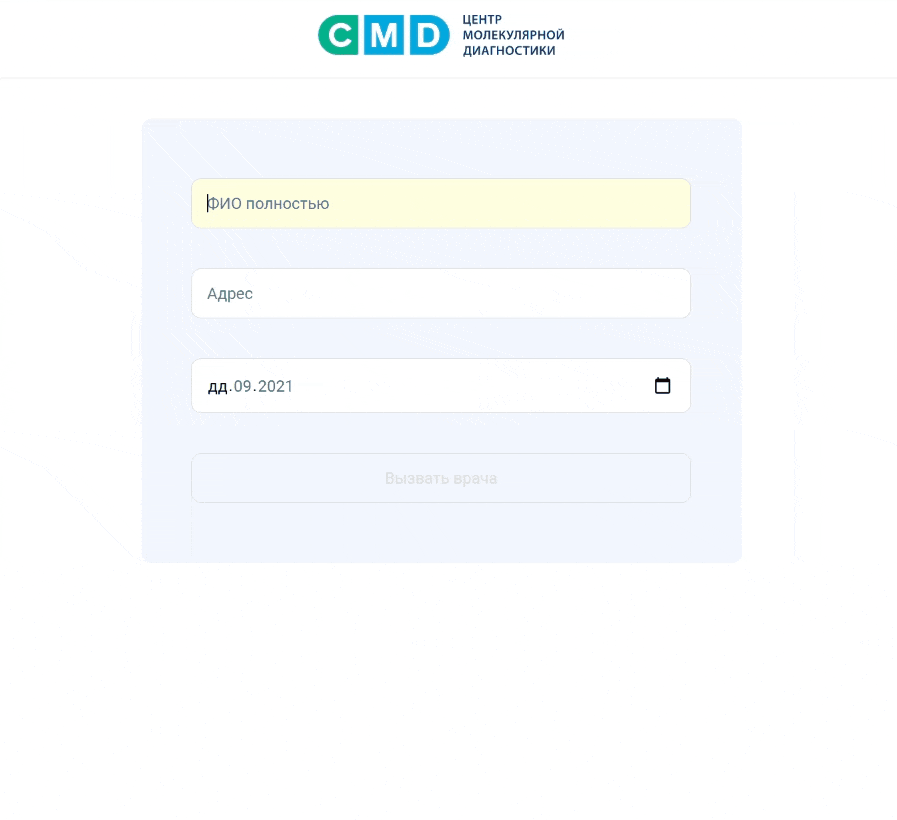

# Приложение для вызова врача на дом


## Описание

SPA приложение для вызова врача на дом.</br>
Деплой: [Вызвать врача](https://rizametovd.github.io/react-call-a-doctor/)</br>

## Задача

На главной странице отобразить форму из 3 полей:</br>

- Поле ФИО — обязательно наличие 3-х слов;</br>
- Поле адреса – реализовать автоподсказки используя API сервиса [Dadata](https://dadata.ru/api/suggest/address/);</br>
- Поле выбора даты — установить интервал: from today — to today + 14 дней;</br>

Организовать валидацию каждого поля формы с показом ошибок.</br>

#### Валидация ФИО:

- Поле заполнено;
- Обязательное наличие 3 слов;
- Ввод только кириллицей;
- Минимальная длина слова 2 символа;

#### Валидация адреса:

- Поле заполнено;
- В объекте адреса присутствуют поля: страна, код страны, долгота, широта, улица, дом;

#### Валидация даты:

- Обязательное поле;
- Выбранная дата не может быть меньше текущей;
- Выбранная дата не может быть более 14 дней от текущей даты;
- Выбранная дата должна быть валидной;

В случае успешной валидации — сформировать и показать номер по шаблону:

```
Russia/RU-MOW/VDV/GLAT55.723171-GLON37.626942/2021-05-28, где:

Russia – страна, полученная из сервиса Dadata
RU-MOW – “region_iso_code” из сервиса Dadata
VDV – Аббревиатура ФИО на английском
GLAT55.723171 – “geo_lat” из сервиса Dadata
GLON37.626942 - “geo_lon” из сервиса Dadata,
2021-05-28 – дата записи
```

## Стек

- React
- JavaScript
- API Dadata

## Установка

Для запуска на локальной машине необходимо:</br>

1. Установить npm зависимости:</br>

```sh
npm install
```

2. Запустить в режиме разработки:</br>

```sh
npm run start
```

Если все прошло успешно, проект будет запущен на `http://localhost:3000`

## Превью

